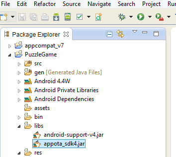
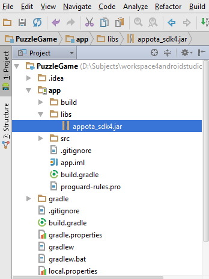
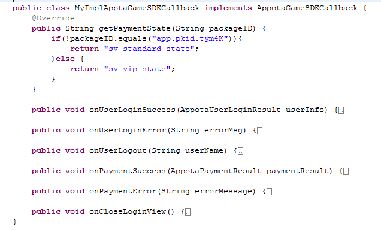
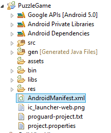
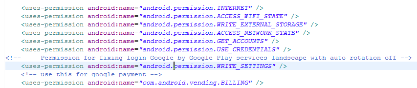
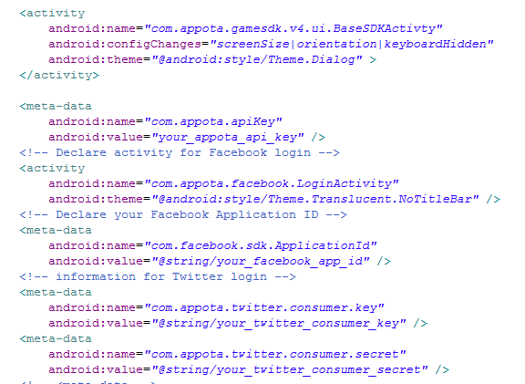
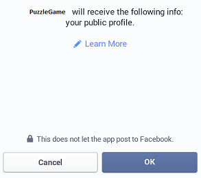
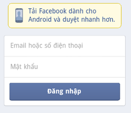
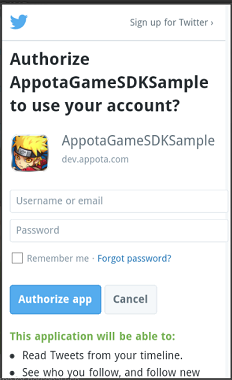

#  Appota Game SDK for Android (version 4)	

Version 4 of the Appota Game for Android has published in this reposity and in <b> Developer Preview </b>. Version 3 will continue to be available in our [appota-android-game-sdk3](https://github.com/appota/android-game-sdk3) repository.


[*(Change logs - upgrade from SDK version 3 to version 4 <- click here*)](#change-logs---upgrade-from-sdk-version-3-to-version-4)

[1. Import Appota SDK 4](#1-import-appota-sdk4)

[2. Client APIs](#2-client-apis)
 
[2.1. Initial SDK 4](#21-init-sdk-4)

[2.2. Configure SDK](#2-2-configure-sdk)

[2.3. Users](#2-3users)

[2.3.1. Register](#231-register)

[2.3.2. Login](#232-login)

[2.3.3. Show user information](#233-show-user-information)

[2.3.4. Get user information](#234-get-user-information)

[2.3.5. Logout](#235-logout)

[2.3.6. Invite facebook friends](#236-invite-facebook-friends)

[2.3.7. Login session](#237-login-session)

[2.4. Payment](#24-payment)

[2.5. Push Notifications](#25-push-notifications)

[2.6. Analytics](#26-analytics)

[3. Exception](#3-exception)

[4. Other functions](#4-other-functions)


## [1. Import Appota SDK4](#header1)

- Copy [appota_sdk4.jar](https://github.com/appota/android-game-sdk/blob/master/libs/appota_sdk4.jar) into libs folder.

  	a.Working with Eclipse

	

  	b.Working with Android Studio

	


	And add appota_sdk4.jar into build.gradle like below:

	`dependencies {`

    `compile fileTree(dir: 'libs', include: ['*.jar'])`

    `compile 'com.android.support:appcompat-v7:22.0.0'`

    **compile files('libs/appota_sdk4.jar')**
	
	`}`


	

- Included libraries in Android Game SDK (if you are using these libs in your project, please remove it ):
	
		- gcm.jar (com.google.android.gcm)
		- twitter4j-core-3.0.5.jar ( twitter4j )

	*Note* : If you use Proguard, add flowing config into your proguard config :

	`-dontwarn com.appota.** ` 

	`-dontwarn twitter4j.**`  

	`-keep class com.appota.**{*;} `

## [2. Client APIs](#header2)
### [2.1. Init SDK 4](#header21)

* Calling `AppotaGameSDK.getInstance().configure(activity,appotaSDKCallback)`  in onCreate of the first starting activity.
	
	```java
	public interface AppotaGameSDKCallback {

		public String getPaymentState(String packageID); // if you don't set specific Payment Package, packageID will be an empty string.
	
		public void onUserLoginSuccess(AppotaUserLoginResult userInfo);

		public void onUserLoginError(String errorMessage);
	
		public void onUserLogout(String userName);
	
		public void onPaymentSuccess(AppotaPaymentResult paymentResult,String packageId);
		
		public void onPaymentError(String errorMessage);

		public void onCloseLoginView();

		public void onPackageSelected(String packageID);
		
	}
	```
	

	[See detail AppotaPaymentResult at 2.4.c](#24-payment)	


	Example:

	


* Extra Methods:

      Hide welcome view: (default is visible)


	- AppotaGameSDK.getInstance().**setHideWelcomeView(true)**.configure(activity,sdkCallback);


	Note.

	Call **AppotaGameSDK.getInstance().finishSDK()**  when application is closed.

	
### [2.2. Configure SDK](#header22)

*	Configure Manifest:
	
	* Open file AndroidManifest.xml in your Android project.
	
	
	    

	* Set basic permissions for SDK

		`<uses-permission android:name="android.permission.INTERNET" />`
    
		`<uses-permission  android:name="android.permission.ACCESS_WIFI_STATE" />`

    	`<uses-permission android:name="android.permission.WRITE_EXTERNAL_STORAGE" />`

    	`<uses-permission android:name="android.permission.ACCESS_NETWORK_STATE" />`

    	`<uses-permission android:name="android.permission.GET_ACCOUNTS" />`

    	`<uses-permission android:name="android.permission.USE_CREDENTIALS" />`

    * Permission for fixing login Google by Google Play services landscape with auto rotation off

    	`<uses-permission android:name="android.permission.WRITE_SETTINGS" />`

    * Permission for Google Play payment

    	`<uses-permission android:name="com.android.vending.BILLING" />`

	


	* Permission for crash reporting.

		`<uses-permission android:name="android.permission.READ_PHONE_STATE" />`
    	`<uses-permission android:name="android.permission.GET_TASKS" />`


	* Declare BaseSDKActivity of SDK:

		 `<activity
            android:name="com.appota.gamesdk.v4.ui.BaseSDKActivty"
            android:configChanges="screenSize|orientation|keyboardHidden"
            android:theme="@android:style/Theme.Dialog" >
        </activity>`

	* Declare APPOTA API KEY:
	
		`<meta-data
            android:name="com.appota.apiKey"
            android:value="your_appota_api_key" />`

	* Declare activity for Facebook login:
	
		 `<activity
            android:name="com.appota.facebook.LoginActivity"
            android:theme="@android:style/Theme.Translucent.NoTitleBar" />`

		Declare meta-data tag for Facebook Application ID

		`<meta-data
            android:name="com.facebook.sdk.ApplicationId"
            android:value="@string/your_facebook_app_id" />`

	* Declare meta-data tag for Twitter login:
		
		`<meta-data
            android:name="com.appota.twitter.consumer.key"
            android:value="@string/your_twitter_consumer_key" />`

        `<meta-data
            android:name="com.appota.twitter.consumer.secret"
            android:value="@string/your_twitter_consumer_secret" />`

	
		if these tags not set, twitter configuration will be set by SDK.

		

		

	* Declare for Push notification
		
		
    	`<uses-permission android:name="com.google.android.c2dm.permission.RECEIVE" />`
    	`<permission android:name="your_package_name.permission.C2D_MESSAGE" android:protectionLevel="signature" />`

    	`<uses-permission android:name="your_package_name.permission.C2D_MESSAGE" />`
    	`<uses-permission android:name="android.permission.WAKE_LOCK" />`
		

        `<service android:name="com.appota.gamesdk.v4.widget.PushHandler" />`

        `<receiver
            android:name="com.appota.gamesdk.v4.network.GCMBroadcastReceiver"`
            `android:permission="com.google.android.c2dm.permission.SEND" >`

        `<intent-filter>`

        `<!-- Receives the actual messages. -->`

        `<action android:name="com.google.android.c2dm.intent.RECEIVE" />`

        `<!-- Receives the registration id. -->`

        `<action android:name="com.google.android.c2dm.intent.REGISTRATION" />`


      	`<category android:name="your_application_package_name" />`

        `</intent-filter>`


      	`</receiver>`
        

### [2.3. Users](#users)

>- SDK provides methods for creating account, login account(using facebook,google & twitter)  on Appota system so  that user can use  their account to make payment.
>
>- **AppotaSDKCallback** is a listener for successful registration, log-in as well as payment transaction ([detail AppotaSDKCallback at 2.1 ](#21-init-sdk-4)).
>

#### [2.3.1. Register](#header231)


Show register view:

`AppotaGameSDK.getInstance().showRegisterView();`

	

#### [2.3.2. Login](#header232)

 Call `AppotaGameSDK.getInstance().showLoginView();`   to open login screen.

 If you don't want to show login screen if user hasn't loggin right after your application starts:

 AppotaGameSDK.getInstance().**setAutoShowLoginDialog(false)**;(default is true)


##### [a. Login by Facebook.](#header232a)

	AppotaGameSDK.getInstance().showLoginFacebook();
	
- if user’s device has installed Facebook application then some dialogs require basic permissions the SDK needs to be allowed will popup.

	

- if user’s device hasn’t installed Facebook application then a web dialog login for Facebook will show up.


	


##### [b. Login by Google.](#header232b)


`AppotaGameSDK.getInstance().showLoginGoogle();`

	
Select any google acount(gmail address) you want to use login:


##### [c. Login by Twitter.](#header232c)


`AppotaGameSDK.getInstance().showLoginTwitter();`


Use your twitter account to fill the Twitter login form:





#### [2.3.3. Show user information](#header233)
	
	AppotaGameSDK.getInstance().showUserInfoView();


#### [2.3.4. Get user information](#header2334)
	
- To get user information: 

	AppotaGameSDK.getInstance().getUserInfo();


	
    return  **AppotaUserLoginResult** ( includes : userId, username, email..)

- To show user's history transaction screen:

	AppotaGameSDK.getInstance().showTransactionHistory();
	

#### [2.3.5. Logout](#header235)

`AppotaGameSDK.getInstance().logout();`
	

#### [2.3.6. Invite facebook friends](#header2352)

`AppotaGameSDK.getInstance().inviteFacebookFriends();`


#### [2.3.7. Login session](#header2352)

Default login session will be kept util logout function called.

If you want users have to login every time they open game/app and their login session will be cleared after they are exit game/app, use below function:

`AppotaGameSDK.getInstance().setKeepLoginSession(false);`


Check whether user is logged-in or not : `AppotaGameSDK.getInstance().isUserLoggedIn()`

**Notice** : Don't forget to call `AppotaGameSDK.getInstance().finishSDK();` in order to make sure this feature works normally as well as some resources of SDK will be released.


### [2.4. Payment](#header24)

>1.Payments implementation guide:
>
>-After logging in SDK, user can select method to do payment(SMS, Card, Bank, Google Play,Bao Kim..).
>
>-After user confirm to make payment, Appota payment system will check the transaction, if success, the system will call **Notify URL** ( declare in dev.appota.com for developer's server process data) if have.
>
>2.Payment State (state) :
>
>-Payment state is a extra field. It is assigned value by developer( empty string if not assigned) before making any payment and returned itself after transaction successfully. You can use it for checking, validation & compararision  in your game(apps).
>You must override getPaymentState(AppotaPaymentPackage) method to set its value when init SDK.([see example at 2.1 ](#21-init-sdk-4)).


- a. Show payment dialog:

	`AppotaGameSDK.getInstance().showPaymentView();`
	

	`AppotaGameSDK.getInstance().showPaymentViewWithPackageID(String packageID);`

	- packageID : ID of package payment. If you want to show only one specific package payment, pass its package id, if not, just pass null or empty string value for show all packages. This packageID will be received on [getPaymentState(String packageID)](#21-init-sdk-4)
		

- b. Methods for showing only one specific payment method separately aren't available in SDK4(SMS,Phone Card,Bank,Google Play payment..);

- c. After making payment successfully, SDK will trigger AppotaGameSDKCallback so you can receive **AppotaPaymentResult**.

	>AppotaPaymentResult is a class contains properties of transaction.
	> 
	>AppotaPaymentResult includes:
	>
	>- transactionId (string): Id of successful transaction.
	>
	>- type (string): method which user just used to make payment(SMS,Bank..)
	>- amount (string): amount of money.
	>
	>- time (Unix time): time that user made payment.
	>
	>- status (int, 0 or 1): success ->1
	>
	>- target(string) : set by developer same as state.
	>
	>- state (string): knows as Payment State, see above.
	>
	>- errorMessage (string): error message if occur.


- d.	Other methods:
	
	+ `AppotaGameSDK.getInstance().setCharacter(String name,String server,String serverIdentify);`

		for creating charging money system on mobile web.

### [2.5. Push Notifications](#header25)

Set push notification to a group:
	
	AppotaGameSDK.getInstance().setPushGroup("device_tokens(group1,group2....)").configure(activity,sdkCallback);

### [2.6. Analytics](#header26)

#### [2.6.1 Send activity log](#header261)

	AppotaGameSDK.getInstance().sendView(activityName)

-actvityName: name of activity(screen)


#### [2.6.2 Send event log](#header262)

	AppotaGameSDK.getInstance().sendEvent(category,action,label)

-category: The name you supply for the group of objects you want to track.

-action : A string that is uniquely paired with each category, and commonly used to define the type of user interaction.

-label : An optional string to provide additional dimensions to the event data.

	AppotaGameSDK.getInstance().sendEvent(category,action,label,value)

-value : An integer that you can use to provide numerical data about the user event.


## 3. Exception##


AppotaGameSDK will throw exceptions if SDK configuration is insufficient or incorrect.

Facebook, Google, Twitter exception only raises if developer use them for login.

Here are exceptions:

|Name|Message|
|----|-------|
| `AppotaAPIKeyException`| There is no com.appota.apiKey found in AndroidManifest.xml|
|`AppotaFacebookAppIDException`|There is no com.facebook.sdk.ApplicationId found in AndroidManifest.xml|
|`AppotaInvalidOperationException`|This exception will be thrown depends on specific situation. 

* Advanced configuration:
	
	Appota Game SDK4 has got crash exception handler itself.
	
	All exceptions are caught by SDK4 will be sent to server & available for dev for viewing & analyzing.

	If you're using Crashlytics or other crash reporting but you want to using Apota exception handler of SDK call autoCatchException method (default auto catch exception if you are not using any crash reporting):

	`AppotaGameSDK.getInstance().autoCatchException();`

	You may want to see crash log in logcat while coding, turn off auto catch exception: `AppotaGameSDK.getInstance().ignoreAutoCatchException();`

## 4. Other functions

4.1 Hide/show SDK floating button:

`AppotaGameSDK.getInstance().setSDKButtonVisibility(boolean)`


Default is true.


4.2 Use small SDK floating button:

`AppotaGameSDK.getInstance().useSmallSDKButton()`


## Change logs - Upgrade from SDK version 3 to version 4:

1. Changes in configure SDK:

1.1 Changes in configure Manifest:

1.1.a. REMOVE those declarations in SDK 3:

		<activity
            android:name="com.appota.gamesdk.UserActivity"
            android:configChanges="orientation|keyboardHidden|screenSize"
            android:theme="@style/Theme.Appota.GameSDK"
            android:windowSoftInputMode="adjustPan" />
        <activity
            android:name="com.appota.gamesdk.UserInfoActivity"
            android:configChanges="orientation|keyboardHidden|screenSize"
            android:theme="@style/Theme.Appota.GameSDK"
            android:windowSoftInputMode="adjustPan" />
        <activity
            android:name="com.appota.gamesdk.PaymentActivity"
            android:configChanges="orientation|keyboardHidden|screenSize"
            android:theme="@style/Theme.Appota.GameSDK" />
		
1.1.b. CHANGE name meta-data tag for Twitter login:

		 <meta-data android:name="com.appota.gamesdk.twitter.consumer.key"
			 android:value="YOUR_CONSUMER_KEY" />
    	<meta-data android:name="com.appota.gamesdk.twitter.consumer.secret"
			 android:value="YOUR_SECRET_KEY" />

to:
		
		<meta-data android:name="com.appota.twitter.consumer.key" 
			android:value="YOUR_CONSUMER_KEY" />

		<meta-data android:name="com.appota.twitter.consumer.secret" 
			android:value="YOUR_SECRET_KEY" />


1.1.c. ADD declaration for SDK version 4:
		
		
		<activity
            android:name="com.appota.gamesdk.v4.ui.BaseSDKActivty"
            android:theme="@android:style/Theme.Dialog" >
        </activity>

		<!-- START Configuration for Push Notification -->
		<uses-permission android:name="com.google.android.c2dm.permission.RECEIVE" />
		<permission
	        android:name="your_application_packagename.permission.C2D_MESSAGE"
	        android:protectionLevel="signature" />
	
	    <uses-permission android:name="your_application_packagename.permission.C2D_MESSAGE" />
	    <uses-permission android:name="android.permission.WAKE_LOCK" />
        <service android:name="com.appota.gamesdk.v4.widget.PushHandler" />
		<receiver
            android:name="com.appota.gamesdk.v4.network.GCMBroadcastReceiver"
            android:permission="com.google.android.c2dm.permission.SEND" >
            <intent-filter>

                <!-- Receives the actual messages. -->
                <action android:name="com.google.android.c2dm.intent.RECEIVE" />
                <!-- Receives the registration id. -->
                <action android:name="com.google.android.c2dm.intent.REGISTRATION" />

                <category android:name="your_application_packagename" />
            </intent-filter>
        </receiver>
		<!-- Sender ID for push notification -->
        <meta-data
            android:name="com.appota.push.gcm_sender_id"
            android:value="id:YOUR_GOOGLE_PROJECT_ID" />
        <!-- END configuration for Push Notification -->


1.2 Changes in SDK Configuration:

1.2.1 CHANGE initial SDK version 3:

a.	Initial SDK:

	AppotaGameSDK.getInstance().init(Activity activity, String apiKey, String YOUR_NOTICE_URL, String YOUR_CONFIG_URL);

to:

	AppotaGameSDK.getInstance().configure(Activity activity, AppotaGameSDKCallback sdkCallback);

	

**AppotaSDKCallback** is a listener for successful registration, log-in as well as payment transaction ([detail AppotaSDKCallback at 2.1 ](#21-init-sdk-4)).


b. Finish SDK, clear resources:

	AppotaGameSDK.getInstance().finish();

to: 

	AppotaGameSDK.getInstance().finishSDK();

c. Show login dialog:
	AppotaGameSDK.getInstance().showLogin();

to:

	AppotaGameSDK.getInstance().showLoginView();

d. Show payment dialog:

	AppotaGameSDK.getInstance().makePayment();

to:

	AppotaGameSDK.getInstance().showPaymentView();

	or

	AppotaGameSDK.getInstance().showPaymentViewWithPackageID(String package_id);

e. Show user information dialog:

	AppotaGameSDK.getInstance().showUserInfo();

to:

	AppotaGameSDK.getInstance().showUserInfoView();


f.	Close payment dialog:

	AppotaGameSDK.getInstance().closePayment();

to:

	AppotaGameSDK.getInstance().closePaymentView();

g.	Check whether user has been logged in or not.

	AppotaGameSDK.getInstance().checkUserLogin();

to:

	AppotaGameSDK.getInstance().isUserLoggedIn();


1.2.2 NO longer use class AppotaReceiver, use AppotaSDKCallback instead.

1.2.3 Many functions added.(see above).

