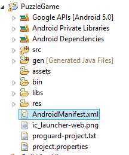
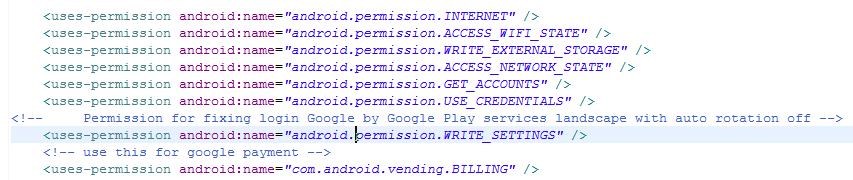
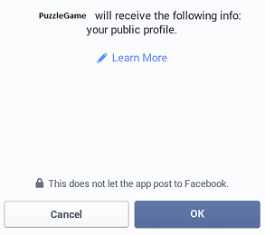
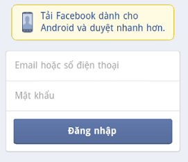

#  Appota game Android 的SDK 4

Appota Game 安卓的SDK4已展开并在开发人员预览版。第3版本还在 [appota-android-game-sdk3](https://github.com/appota/android-game-sdk3) repository.


[*( SDK3更新到SDK4更改->请点击查看*)](#sdk3到sdk4的升级更改)

[1. 导入appota SDK4 到应用](#1-导入appota-sdk4-到应用)

[2. 客户端的APIs](#2-客户端的apis)
 
[2.1. 初始化 Appota SDK 4](#21-初始化appota-sdk-4)

[2.2. SDK 配置](#22-sdk配置)

[2.3. 用户相关功能](#23-用户相关功能)

[2.3.1. Register](#231-注册)

[2.3.2. Login](#232-登录)

[2.3.3. 显示用户信息界面](#233--显示用户信息)

[2.3.4. 导出用户信息](#234-导出用户信息)

[2.3.5. 退出](#235-退出)

[2.3.6. 邀请Facebook的朋友玩游戏](#236-邀请facebook的朋友玩游戏)

[2.3.7. 登录会话](#237-登录会话)

[2.4. 支付相关功能](#24-支付相关功能)

[2.5. 推送通知（ push notification）相关功能](#25-push-notifications)

[2.6. 统计相关功能](#26-统计相关功能)

[3. 处理-担任应用Crash错误](#3-exception)

[4. 其他方式](#sdk3到sdk4的升级更改)


## [1. 导入appota SDK4 到应用](#header1)

- •	复制 [appota_sdk4.jar](https://github.com/appota/android-game-sdk/blob/master/libs/appota_sdk4.jar) 到项目的libs文件.

  	a.Eclipse 操作

	

  	b.Android Studio 操作

	


	  按下面添加build.gradle配置

	`dependencies {`

    `compile fileTree(dir: 'libs', include: ['*.jar'])`

    `compile 'com.android.support:appcompat-v7:22.0.0'`

    **compile files('libs/appota_sdk4.jar')**
	
	`}`


	

- •	下面仓库为已集成安卓SDK4（若你正在使用该仓库，请在项目的libs文件消除仓库文件）:
	
		- gcm.jar (com.google.android.gcm)
		- twitter4j-core-3.0.5.jar ( twitter4j )

	*Note* : 注意：若你使用Proguard，请将下面配置添加到自己的proguard配置文件

	`-dontwarn com.appota.** ` 

	`-dontwarn twitter4j.**`  

	`-keep class com.appota.**{*;} `

## [2. 客户端的APIs](#header2)
### [2.1. 初始化Appota SDK 4](#header21)

* 在应用打开后第一个activity 的onCreate调用AppotaGameSDK.getInstance().configure(activity,appotaSDKCallback)方式.
	
	```java
	public interface AppotaGameSDKCallback {

		public String getPaymentState(String packageID); // if you don't set specific Payment Package, packageID will be an empty string.
	
		public void onUserLoginSuccess(AppotaUserLoginResult userInfo);

		public void onUserLoginError(String errorMessage);
	
		public void onUserLogout(String userName);
	
		public void onPaymentSuccess(AppotaPaymentResult paymentResult,String packageId);
		
		public void onPaymentError(String errorMessage);

		public void onCloseLoginView();

		public void onPackageSelected(String packageID);
		
	}
	```
	

	[AppotaPaymentResult 在2.4.c详细查看](#24-支付相关功能)	


	例如:

	


* 扩大方式:

	 隐藏welcome view (默认为显示)


	- AppotaGameSDK.getInstance().**setHideWelcomeView(true)**.configure(activity,sdkCallback);


	注意： 应用关闭之时调用AppotaGameSDK.getInstance().finishSDK()	

	
### [2.2. SDK配置](#header22)

*	Manifest 配置：
	
	* 在项目打开AndroidManifest.xml.
	
	
	    

	* 配置sdk所需权限

		`<uses-permission android:name="android.permission.INTERNET" />`
    
		`<uses-permission  android:name="android.permission.ACCESS_WIFI_STATE" />`

    	`<uses-permission android:name="android.permission.WRITE_EXTERNAL_STORAGE" />`

    	`<uses-permission android:name="android.permission.ACCESS_NETWORK_STATE" />`

    	`<uses-permission android:name="android.permission.GET_ACCOUNTS" />`

    	`<uses-permission android:name="android.permission.USE_CREDENTIALS" />`

    * 应用屏幕设置水平居自动旋转屏幕已停用之时，可修改登录Google Accounts

    	`<uses-permission android:name="android.permission.WRITE_SETTINGS" />`

    * 允许向Google Play支付

    	`<uses-permission android:name="com.android.vending.BILLING" />`

	


	* 输入SDK  的BaseSDKActivity:

		 `<activity
            android:name="com.appota.gamesdk.v4.ui.BaseSDKActivty"
            android:configChanges="screenSize|orientation|keyboardHidden"
            android:theme="@android:style/Theme.Dialog" >
        </activity>`

	* 输入APPOTA API KEY:
	
		`<meta-data
            android:name="com.appota.apiKey"
            android:value="your_appota_api_key" />`

	* 输入activity 让 Facebook login:
	
		 `<activity
            android:name="com.appota.facebook.LoginActivity"
            android:theme="@android:style/Theme.Translucent.NoTitleBar" />`

		输入meta-data卡 给 Facebook Application ID

		`<meta-data
            android:name="com.facebook.sdk.ApplicationId"
            android:value="@string/your_facebook_app_id" />`

	* 	输入meta-data 卡给 Twitter login:
		
		`<meta-data
            android:name="com.appota.twitter.consumer.key"
            android:value="@string/your_twitter_consumer_key" />`

        `<meta-data
            android:name="com.appota.twitter.consumer.secret"
            android:value="@string/your_twitter_consumer_secret" />`

	
		若不输入上面卡那么Twitter 配置将由Appota 提供
		

		


### [2.3. 用户相关功能](#users)

>- SDK提供在Appota系统上的创建，登录账号（用Facebook,Google & Twitter）各种方式，所以用户可通过该账号来进行支付
>
>- **AppotaSDKCallback** 接受账号注册成功、登陆成功及支付交易活动的信息（具体查看2.1的AppotaSDKCallback ） ([detail AppotaSDKCallback at 2.1 ](#21-初始化appota-sdk-4)).
>

#### [2.3.1. 注册](#header231)


调用下面方式打开注册界面:

`AppotaGameSDK.getInstance().showRegisterView();`

	

#### [2.3.2. 登录](#header232)

 调用 `AppotaGameSDK.getInstance().showLoginView();`   方式来显示登录界面.

 若您每次进入游戏并尚未登录之时而不要显示登录界面：
 
 AppotaGameSDK.getInstance().**setAutoShowLoginDialog(false)**;(默认为 true)


##### [a. Facebook登录.](#header232a)

	AppotaGameSDK.getInstance().showLoginFacebook();
	
- 用户设备已设置Facebook 应用之时，将显示POP UP 要求提供SDK基本权限

	

- •	用户尚未设置FACEBOOK应用之时，将通过Web view显示一个登录并要求基本权限POPUP .


	


##### [b. Google登录.](#header232b)


`AppotaGameSDK.getInstance().showLoginGoogle();`

	
选择你要用来登录的谷歌账号（Gmail) :


##### [c. c.Twitter登录.](#header232c)


`AppotaGameSDK.getInstance().showLoginTwitter();`


登录者注册twitter账号:


#### [2.3.3.  显示用户信息](#header233)
	
	AppotaGameSDK.getInstance().showUserInfoView();


#### [2.3.4. 导出用户信息](#header2334)
	
- 获取用户信息: 

	AppotaGameSDK.getInstance().getUserInfo();


	
    发还  **AppotaUserLoginResult** ( 包括 : userId, username, email..)

- •	打开用户交易历史界面:

	AppotaGameSDK.getInstance().showTransactionHistory();
	

#### [2.3.5. 退出](#header235)

`AppotaGameSDK.getInstance().logout();`
	

#### [2.3.6. 邀请Facebook的朋友玩游戏](#header2352)

`AppotaGameSDK.getInstance().inviteFacebookFriends();`


#### [2.3.7. 登录会话](#header2352)

默认登录状态将维持到玩家选择退出。
若你要用户当打开应用就要登录应用并且当关闭应用就自动退出。烦请采用下面方式:

`AppotaGameSDK.getInstance().setKeepLoginSession(false);`


检查用户是否登录：
 `AppotaGameSDK.getInstance().isUserLoggedIn()`

**Notice** : 注：记得调用  `AppotaGameSDK.getInstance().finishSDK();` 当你的应用关闭以保持应用运行正常，也是保持可解放SDK的资源。


### [2.4. 支付相关功能](#header24)

>1.实行支付引导:
>
>-登录上课sdk后，用户可以选择支付方式（通过sms,银行、电话卡、google play...）.
>
>-用户确认实行支付后，Appota支付系统将显示确认pop-up并且验证交易，若成功，系统将自动调用若有 **Notify URL** ( 在 dev.appota.com填报让研发的服务器处理) 。
>
>2.Payment State (state) :
>
>-Payment state是扩大 场。作出任何支付之前它的价值被分配给研发人（发还时若为分，价值为空），交易成功后就返还该价值。你可以用它来检查、验证、对比...
>当初始化SDK, 你要补充到 getPaymentState(AppotaPaymentPackage) 方式来配置它的价值。([查看2.1的比列](#21-初始化appota-sdk-4)).


- a. 显示支付pop-up: 显示所有支付包:

	`AppotaGameSDK.getInstance().showPaymentView();`
	
	
	显示一个支付包:	
	

	`AppotaGameSDK.getInstance().showPaymentViewWithPackageID(String packageID);`

	- packageID : 支付包的ID。如果你要只显示一个支付包，当调用 makePayment时传输支付包的ID或者 null/empty 来显示所有支付包。支付ID将在 [getPaymentState(String packageID)](#21-初始化appota-sdk-4)
		

- b. SDK4不再显示 确定支付方式;

- c. 支付宝操作成功，SDK调用 AppotaGameSDKCallback 因此你会收到 **AppotaPaymentResult**.

	>AppotaPaymentResult 是含有交易各属性的对象.
	> 
	>AppotaPaymentResult 包括:
	>
	>- transactionId (string): 成功交易的Id.
	>
	>- type (string): 用户要用实行交易的支付方式(SMS,Bank..)
	>- amount (string): 交易金额.
	>
	>- time (Unix time): 玩家进行交易的时间.
	>
	>- status (int, 0 or 1): 成功为1, 失败为 0.
	>
	>- target(string) : 跟state一样 由研发人配置.
	>
	>- state (string): 被视为 Payment State（往上面看）.
	>
	>- errorMessage (string): 通知错误.


- d.	其他方式:
	
	+ `AppotaGameSDK.getInstance().setCharacter(String name,String server,String serverIdentify);`

		用来配置游戏里的玩家信息.

### [2.5. Push Notifications](#header25)
配置 push notification: (可选，默认已经采取SDK)

	AppotaGameSDK.getInstance().setPushDeviceToken("device_token_for_push_notification").configure(activity,sdkCallback);

配置推送通知到一群：
	
	AppotaGameSDK.getInstance().setPushGroup("device_tokens(group1,group2....)").configure(activity,sdkCallback);

### [2.6. 统计相关功能](#header26)

#### [2.6.1 发送屏幕活动统计](#header261)

	AppotaGameSDK.getInstance().sendView(activityName)

-actvityName: Activity(屏幕)名称

#### [2.6.2 发送活动统计](#header262)

	AppotaGameSDK.getInstance().sendEvent(category,action,label)

-category: 你要统计的项目

-action : 每项目的对应的字符串，常用于界定用户互动模式(Click, view, close..).

-label : 提供并且添加活动数据的一串任意字符。

	AppotaGameSDK.getInstance().sendEvent(category,action,label,value)

-value : 你要提供以数型的玩家活动数据的价值 （比如：活动的数次...）.


## 3. Exception##


若SDK配置不足够或者不准确AppotaGameSDK 将出现意外。

 Facebook, Google, Twitter exception 错误只在研发人用到但不填报或者填报不准确时发生。
下面是意外列表:


|名称|错误通知|
|----|-------|
| `AppotaAPIKeyException`| 在AndroidManifest.xml 没有填报 com.appota.apiKey|
|`AppotaFacebookAppIDException`|在AndroidManifest.xml 没有填报 com.facebook.sdk.ApplicationId |
|`AppotaInvalidOperationException`|这个意外在具体的情况下发生| 

* •	提升配置:
	
 Appota Game SDK4本身有担任处理crash的功能。
 
所有意外 (crash exceptions) 被sdk4接受并且留存让研发人查看，分析。


如果你使用Crashlytics或者 crashes其他通知仓库而还要处理SDK的crashes SDK, 烦请以下的方式(默认若你正在使用Crashlytics，自动接受 crashes功能就关闭):

	`AppotaGameSDK.getInstance().autoCatchException();`

若你要查看coding过程中LogCat窗口的crash记录，请暂时关闭SDK自动接受crash功能: `AppotaGameSDK.getInstance().ignoreAutoCatchException();`

## 4. 其他方式：

4.1 隐藏/显示SDK浮动按钮:

`AppotaGameSDK.getInstance().setSDKButtonVisibility(boolean)`


默认配置为 true.


## SDK3到SDK4的升级更改:

1. 	SDK配置更改:

1.1 AndroidManifest.xml配置更改:

1.1.a. 删除SDK3已用的填报：:

		<activity
            android:name="com.appota.gamesdk.UserActivity"
            android:configChanges="orientation|keyboardHidden|screenSize"
            android:theme="@style/Theme.Appota.GameSDK"
            android:windowSoftInputMode="adjustPan" />
        <activity
            android:name="com.appota.gamesdk.UserInfoActivity"
            android:configChanges="orientation|keyboardHidden|screenSize"
            android:theme="@style/Theme.Appota.GameSDK"
            android:windowSoftInputMode="adjustPan" />
        <activity
            android:name="com.appota.gamesdk.PaymentActivity"
            android:configChanges="orientation|keyboardHidden|screenSize"
            android:theme="@style/Theme.Appota.GameSDK" />
		
1.1.b. Twitter登录 meta-data 卡更改:

		 <meta-data android:name="com.appota.gamesdk.twitter.consumer.key"
			 android:value="YOUR_CONSUMER_KEY" />
    	<meta-data android:name="com.appota.gamesdk.twitter.consumer.secret"
			 android:value="YOUR_SECRET_KEY" />

改为:
		
		<meta-data android:name="com.appota.twitter.consumer.key" 
			android:value="YOUR_CONSUMER_KEY" />

		<meta-data android:name="com.appota.twitter.consumer.secret" 
			android:value="YOUR_SECRET_KEY" />


1.1.c. 新增SDK 4填报:
		
		
		<activity
            android:name="com.appota.gamesdk.v4.ui.BaseSDKActivty"
            android:theme="@android:style/Theme.Dialog" >
        </activity>

		<!-- START Configuration for Push Notification -->
		<uses-permission android:name="com.google.android.c2dm.permission.RECEIVE" />
		<permission
	        android:name="your_application_packagename.permission.C2D_MESSAGE"
	        android:protectionLevel="signature" />
	
	    <uses-permission android:name="your_application_packagename.permission.C2D_MESSAGE" />
	    <uses-permission android:name="android.permission.WAKE_LOCK" />
        <service android:name="com.appota.gamesdk.v4.widget.PushHandler" />
		<receiver
            android:name="com.appota.gamesdk.v4.network.GCMBroadcastReceiver"
            android:permission="com.google.android.c2dm.permission.SEND" >
            <intent-filter>

                <!-- Receives the actual messages. -->
                <action android:name="com.google.android.c2dm.intent.RECEIVE" />
                <!-- Receives the registration id. -->
                <action android:name="com.google.android.c2dm.intent.REGISTRATION" />

                <category android:name="your_application_packagename" />
            </intent-filter>
        </receiver>
		<!-- Sender ID for push notification -->
        <meta-data
            android:name="com.appota.push.gcm_sender_id"
            android:value="id:YOUR_GOOGLE_PROJECT_ID" />
        <!-- END configuration for Push Notification -->


1.2 SDK配置更改：

1.2.1 SDK3初始化更改：

a.  初始化SDK 3:

	AppotaGameSDK.getInstance().init(Activity activity, String apiKey, String YOUR_NOTICE_URL, String YOUR_CONFIG_URL);

改为:

	AppotaGameSDK.getInstance().configure(Activity activity, AppotaGameSDKCallback sdkCallback);

	

**AppotaSDKCallback** 接受账号注册成功、登陆成功及支付交易活动的信息 ([具体查看2.1的AppotaSDKCallback](#21-初始化appota-sdk-4)).


b. 结束SDK, 清理资源:

	AppotaGameSDK.getInstance().finish();

改为 : 

	AppotaGameSDK.getInstance().finishSDK();

c. 显示登陆界面：

	AppotaGameSDK.getInstance().showLogin();

改为 :

	AppotaGameSDK.getInstance().showLoginView();

d. 显示支付界面：

	AppotaGameSDK.getInstance().makePayment();

改为

	AppotaGameSDK.getInstance().showPaymentView();

或者

	AppotaGameSDK.getInstance().showPaymentViewWithPackageID(String package_id);

e. 显示用户信息界面：

	AppotaGameSDK.getInstance().showUserInfo();

改为

	AppotaGameSDK.getInstance().showUserInfoView();


f. 关闭支付界面:

	AppotaGameSDK.getInstance().closePayment();

改为 :

	AppotaGameSDK.getInstance().closePaymentView();

g. 检查玩家是否登录：

	AppotaGameSDK.getInstance().checkUserLogin();

改为 :

	AppotaGameSDK.getInstance().isUserLoggedIn();


1.2.2 不再使用 AppotaReceiver, 用 AppotaSDKCallback 来代替。

1.2.3 甚多新增功能（往上面看）

