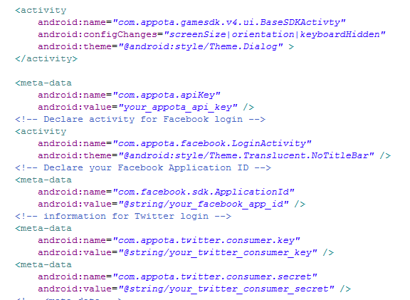
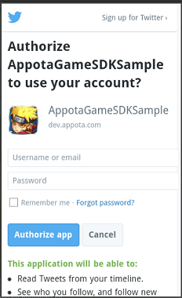

#  Appota Game SDK for Android (Version 4)	

Phiên bản 4 SDK Game cho Android của Appota đã được cập nhật tại repo này và đang ở chế độ <b> Developer Preview </b>. Phiên bản 3 vẫn sẽ sẵn có tại repo [appota-android-game-sdk3](https://github.com/appota/android-game-sdk3).


[*(Những thay đổi - cập nhật từ phiên bản SDK 3 lên 4 <- click liên kết này*)](#change-logs---upgrade-from-sdk-version-3-to-version-4)

[1. Import Appota SDK 4 vào ứng dụng](#1-import-appota-sdk4-vào-ứng-dụng)

[2. Những APIs phía client](#2-những-apis-phía-client)
 
[2.1. Khởi tạo Appota SDK4 trong project](#21-khởi-tạo-appota-sdk4-trong-project)

[2.2. Cấu hình SDK](#22-cấu-hình-sdk)

[2.3. Các chức năng liên quan đến người dùng](#23-các-chức-năng-liên-quan-đến-người-dùng)

[2.3.1. Đăng ký](#231-Đăng-ký)

[2.3.2. Đăng nhập](#232-Đăng-nhập)

[2.3.3. Hiển thị màn hình thông tin người dùng](#233-hiển-thị-màn-hình-thông-tin-người-dùng)

[2.3.4. Truy xuất thông tin người dùng](#234-truy-xuất-thông-tin-người-dùng)

[2.3.5. Đăng xuất](#235-Đăng-xuất)

[2.3.6. Mời bạn bè từ Facebook chơi game](#236-mời-bạn-bè-facebook-chơi-game)

[2.3.7. Phiên đăng nhập](#237-phiên-đăng-nhập)

[2.4. Các chức năng liên quan đến thanh toán](#24-các-chức-năng-liên-quan-đến-thanh-toán)

[2.5. Các chức năng liên quan đến push notification](#25-các-chức-năng-liên-quan-đến-push-notification)

[2.6. Các chức năng liên quan đến thống kê](#26-các-chức-năng-liên-quan-đến-thống-kê)

[3. Xử lý - Đảm nhiệm lỗi crash ứng dụng](#3-xử-lý---Đảm-nhiệm-lỗi-crash-ứng-dụng)

[4. Những phương thức khác](#4-những-phương-thức-khác)


## [1. Import Appota SDK4 vào ứng dụng](#header1)

- Sao chép tệp tin [appota_sdk4.jar](https://github.com/appota/android-game-sdk/blob/master/android-game-sdk-library/appota_sdk4.jar) vào thư mục libs của project.

  	a.Làm việc với Eclipse

	

  	b.Làm việc với Android Studio

	


	Thêm cấu hình build.gradle như bên dưới:

	`dependencies {`

    `compile fileTree(dir: 'libs', include: ['*.jar'])`

    `compile 'com.android.support:appcompat-v7:22.0.0'`

    **compile files('libs/appota_sdk4.jar')**
	
	`}`


	

- Những thư viện đã được tích hợp sẵn vào trong Android SDK4 được liệt kê dưới đây.(Nếu bạn đang dùng những thư viện này thì hãy loại bỏ tệp tin thư viện đó trong thư mục libs ở project):
	
		- gcm.jar (com.google.android.gcm)
		- twitter4j-core-3.0.5.jar ( twitter4j )

	*Chú ý* : Nếu bạn sử dụng Proguard, hãy thêm cấu hình dưới đây vào trong nội dung tệp cấu hình proguard của mình:

	`-dontwarn com.appota.** ` 

	`-dontwarn twitter4j.**`  

	`-keep class com.appota.**{*;} `

## [2. Những APIs phía client](#header2)
### [2.1. Khởi tạo Appota SDK4 trong project](#header21)

* Gọi phương thức `AppotaGameSDK.getInstance().configure(activity,appotaSDKCallback)`  trong phương thức onCreate của Activity đầu tiên mở ứng dụng.
	
	```java
	public abstract class AppotaGameSDKCallback {

		public abstract String getPaymentState(String packageId); // if you don't set specific Payment Package, packageID will be an empty string.
	
		public abstract void onPaymentSuccess(AppotaPaymentResult paymentResult,String packageId);

		public abstract void onUserLoginSuccess(AppotaUserLoginResult userInfo);
	
		public abstract void onUserLogout(String userName);
	
		public void onPaymentError(String errorMessage){}
		
		public void onPackageSelected(String packageID){}

		public void onCloseLoginView(){}

		public void onClosePaymentView(){}
		
	}
	```
	

	[Xem chi tiết về AppotaPaymentResult tại 2.4.c](#24-các-chức-năng-liên-quan-đến-thanh-toán)	


	Ví dụ:

	


* Những phương thức mở rộng:

      Ẩn màn hình popup chào (Mặc định là hiển thị)


	- AppotaGameSDK.getInstance().**setHideWelcomeView(true)**.configure(activity,sdkCallback);


	Chú ý.

	Gọi **AppotaGameSDK.getInstance().finishSDK()**  khi ứng dụng của bạn đóng lại.

	
### [2.2. Cấu hình SDK](#header22)

*	Cấu hình Manifest:
	
	* Mở tệp tin AndroidManifest.xml trong project của bạn.
	
	
	    

	* Cấu hình những quyền cần thiết cho SDK

		`<uses-permission android:name="android.permission.INTERNET" />`
    
		`<uses-permission  android:name="android.permission.ACCESS_WIFI_STATE" />`

    	`<uses-permission android:name="android.permission.WRITE_EXTERNAL_STORAGE" />`

    	`<uses-permission android:name="android.permission.ACCESS_NETWORK_STATE" />`

    	`<uses-permission android:name="android.permission.GET_ACCOUNTS" />`

    	`<uses-permission android:name="android.permission.USE_CREDENTIALS" />`

    * Quyền để sửa lỗi đăng nhập Google Accounts khi màn hình ứng dụng set ngang và chế độ tự xoay bị tắt.

    	`<uses-permission android:name="android.permission.WRITE_SETTINGS" />`

    * Quyền cho thanh toán Google Play.

    	`<uses-permission android:name="com.android.vending.BILLING" />`

	

	* Quyền cho thống kê những crash của ứng dụng.

		`<uses-permission android:name="android.permission.READ_PHONE_STATE" />`
    	`<uses-permission android:name="android.permission.GET_TASKS" />`


	* Khai báo BaseSDKActivity của SDK:

		 `<activity
            android:name="com.appota.gamesdk.v4.ui.BaseSDKActivty"
            android:configChanges="screenSize|orientation|keyboardHidden"
            android:theme="@android:style/Theme.Dialog" >
        </activity>`

	* Khai báo APPOTA API KEY:
	
		`<meta-data
            android:name="com.appota.apiKey"
            android:value="your_appota_api_key" />`

	* Khai báo activity cho Facebook login:
	
		 `<activity
            android:name="com.appota.facebook.LoginActivity"
            android:theme="@android:style/Theme.Translucent.NoTitleBar" />`

		Khai báo thẻ meta-data cho Facebook Application ID

		`<meta-data
            android:name="com.facebook.sdk.ApplicationId"
            android:value="@string/your_facebook_app_id" />`

	* Khai báo thẻ meta-data for Twitter login:
		
		`<meta-data
            android:name="com.appota.twitter.consumer.key"
            android:value="@string/your_twitter_consumer_key" />`

        `<meta-data
            android:name="com.appota.twitter.consumer.secret"
            android:value="@string/your_twitter_consumer_secret" />`


		

		Nếu những thẻ này không được khai báo thì cấu hình Twitter sẽ được lấy bởi của chính Appota.

	* Khai báo dùng cho Push notification

	
    	`<uses-permission android:name="com.google.android.c2dm.permission.RECEIVE" />`
    	`<permission android:name="your_package_name.permission.C2D_MESSAGE" android:protectionLevel="signature" />`

    	`<uses-permission android:name="your_package_name.permission.C2D_MESSAGE" />`
    	`<uses-permission android:name="android.permission.WAKE_LOCK" />`
		

        `<service android:name="com.appota.gamesdk.v4.widget.PushHandler" />`

        `<receiver
            android:name="com.appota.gamesdk.v4.network.GCMBroadcastReceiver"`
            `android:permission="com.google.android.c2dm.permission.SEND" >`

        `<intent-filter>`

        `<!-- Receives the actual messages. -->`

        `<action android:name="com.google.android.c2dm.intent.RECEIVE" />`

        `<!-- Receives the registration id. -->`

        `<action android:name="com.google.android.c2dm.intent.REGISTRATION" />`


      	`<category android:name="your_application_package_name" />`

        `</intent-filter>`


      	`</receiver>`
        

### [2.3. Các chức năng liên quan đến người dùng](#users)

>- SDK cung cấp những phương thức để tạo, đăng nhập tài khoản(dùng Facebook,Google & Twitter) trên hệ thống Appota vì vậy mà người dùng có thể thực hiện thanh toán bằng tài khoản này.
>
>- **AppotaSDKCallback** là listener khi đăng ký tài khoản thành công, đăng nhập thành công cũng như các sự kiện trên giao dịch thanh toán([Chi tiết AppotaSDKCallback ở 2.1 ](#21-khởi-tạo-appota-sdk4-trong-project)).
>

#### [2.3.1. Đăng ký](#header231)


Gọi phương thức dưới để mở màn hình đăng ký:

`AppotaGameSDK.getInstance().showRegisterView();`

	

#### [2.3.2. Đăng nhập](#header232)

 Gọi phương thức `AppotaGameSDK.getInstance().showLoginView();`   để hiển thị màn hình đăng nhập.

 Nếu bạn không muốn hiển thị màn hình đăng nhập mỗi khi vào game khi người dùng chưa đăng nhập thì cấu hình như dưới::

 AppotaGameSDK.getInstance().**setAutoShowLoginDialog(false)**;(Mặc định là true)


##### [a. Đăng nhập bằng Facebook.](#header232a)

	AppotaGameSDK.getInstance().showLoginFacebook();
	
- Nếu thiết bị của người dùng đã cài đặt ứng dụng Facebook thì sẽ hiển thị một vài hộp thoại thông báo yêu cầu cấp những quyền cơ bản cho SDK.

	

- Nếu thiết bị của người dụng chưa cài đặt ứng dụng Facebook thì một hộp thoại đăng nhập cũng như hỏi quyền cơ bản bằng Web view sẽ hiển thị.


	


##### [b. Đăng nhập bằng Google.](#header232b)


`AppotaGameSDK.getInstance().showLoginGoogle();`

	
Chọn tài khoản Google (địa chỉ Gmail) bạn muốn dùng để đăng nhập.


##### [c. Đăng nhập bằng Twitter.](#header232c)


`AppotaGameSDK.getInstance().showLoginTwitter();`


Đăng nhập Twitter hoặc đăng ký một tài khoản nếu chưa có:





#### [2.3.3. Hiển thị màn hình thông tin người dùng](#header233)
	
	AppotaGameSDK.getInstance().showUserInfoView();


#### [2.3.4. Truy xuất thông tin người dùng](#header2334)
	
- Lấy thông tin người dùng: 

	AppotaGameSDK.getInstance().getUserInfo();


	
    trả về  **AppotaUserLoginResult** ( bao gồm : userId, username, email..)

- Mở màn hình lịch sử giao dịch của người dùng:

	AppotaGameSDK.getInstance().showTransactionHistory();
	

#### [2.3.5. Đăng xuất](#header235)

`AppotaGameSDK.getInstance().logout();`
	

#### [2.3.6. Mời bạn bè Facebook chơi game](#header2352)

`AppotaGameSDK.getInstance().inviteFacebookFriends();`


#### [2.3.7. Phiên đăng nhập](#header2352)

Mặc định trạng thái đăng nhập sẽ được giữ đến khi người dùng chọn đăng xuất.

Nếu bạn muốn người dùng phải thực hiện đăng nhập mỗi khi vào ứng dụng và tự động đăng xuất khi người dùng đóng ứng dụng, hãy dùng phương thức dưới đây:

`AppotaGameSDK.getInstance().setKeepLoginSession(false);`


Kiểm tra trạng thái người chơi đã đăng nhập hay chưa : `AppotaGameSDK.getInstance().isUserLoggedIn()` trả về kiểu boolean - true nếu người dùng đã đăng nhập.

**Chú ý** : Đứng quên gọi `AppotaGameSDK.getInstance().finishSDK();` khi ứng dụng của bạn đóng lại để đảm bảo tính năng này hoạt động bình thường cũng như là những tài nguyên dành cho SDK sẽ được giải phóng.


### [2.4. Các chức năng liên quan đến thanh toán](#header24)

>1.Hướng dẫn thực hiện thanh toán:
>
>-Sau khi đăng nhập bằng SDK, người dùng có thể lựa chọn phương thức để thực hiện thanh toán( qua SMS, Card, Bank, Google Play,Bao Kim..).
>
>-Sau khi người dùng xác nhận để thực hiện thanh toán, hệ thống thanh toán của Appota sẽ hiển thị hộp thoại xác nhận và sẽ kiểm tra gia dịch, nếu thành công, hệ thống sẽ tự động gọi **Notify URL** ( được khai báo trong in dev.appota.com để server của người phát triển xử lý dữ liệu) nếu có.
>
>2.Payment State (state) :
>
>-Payment state là một trường mở rộng. Nó được gán giá trị vởi người phát triển (developer)(giá trị rỗng khi trả về nếu không được gán) trước khi tạo bất cứ thanh toán nào và được trả về sau khi giao dịch thành công. Bạn có thể dùng nó để kiểm tra, xác thực, so sánh..
>Bạn phải bổ sung trong phương thức getPaymentState(AppotaPaymentPackage) để cài đặt giá trị của nó khi khởi tạo SDK.([xem ví dụ ở 2.1 ](#21-khởi-tạo-appota-sdk4-trong-project)).


- a. Hiển thị hộp thoại thanh toán:


	Hiển thị tất cả các gói thanh toán:

	`AppotaGameSDK.getInstance().showPaymentView();`
	

	Hiển thị một gói thanh toán:


	`AppotaGameSDK.getInstance().showPaymentViewWithPackageID(String packageID);`

	- packageID : ID của gói thanh toán. Nếu bạn muốn chỉ hiển thị một gói thanh toán, truyền ID của gói khi gọi makePayment hoặc truyền null/empty để hiển thị tất cả các gọi thanh toán. ID gói thanh toán sẽ được nhận lại tại  [getPaymentState(String packageID)](#21-khởi-tạo-appota-sdk4-trong-project)
		

- b. MNhững phương thức để hiển thị một phương thức thanh toán xác định(chỉ riêng SMS, Phone Card, Bank,..) không còn dùng trong SDK 4.

- c. Sau khi tạo gói thanh toán thành công, SDK sẽ gọi AppotaGameSDKCallback vì vậy bạn có thể nhận được **AppotaPaymentResult**.

	>AppotaPaymentResult là một đối tượng chứa các thuộc tính của giao dịch.
	> 
	>AppotaPaymentResult bao gồm:
	>
	>- transactionId (string): Id của giao dịch thành công.
	>
	>- type (string): phương thức mà người dùng muốn dùng để tạo thanh toán(SMS,Bank..)
	>- amount (string): Số tiền.
	>
	>- time (Unix time): thời gian mà người dùng thanh toán.
	>
	>- status (int, 0 or 1): thành công ->1, thất bại -> 0.
	>
	>- target(string) : được cài đặt bởi người phát triển giống như state.
	>
	>- state (string): biết đến như là Payment State xem ở trên.
	>
	>- errorMessage (string): thông báo lỗi nếu có.


- d.	Những phương thức khác:
	
	+ `AppotaGameSDK.getInstance().setCharacter(String name,String server,String serverIdentify);`

		để cài đặt thông tin của người dùng trong trò chơi.

### [2.5. Các chức năng liên quan đến push notification](#header25)

[Cấu hình Push Notification xem ở cấu hình SDK](#22-cấu-hình-sdk)

Thiết lập push notification tới một nhóm:
	
	AppotaGameSDK.getInstance().setPushGroup("device_tokens(group1,group2....)").configure(activity,sdkCallback);

### [2.6. Các chức năng liên quan đến thống kê](#header26)

#### [2.6.1 Gửi thống kê hoạt động màn hình](#header261)

	AppotaGameSDK.getInstance().sendView(activityName)

-actvityName: Tên của Activity(màn hình)


#### [2.6.2 Gửi thống kê sự kiện](#header262)

	AppotaGameSDK.getInstance().sendEvent(category,action,label)

-category: Tên danh mục mà bạn muốn dùng thống kê sự kiện.

-action : Chuỗi kí tự ứng với mỗi danh mục, và thường dùng định nghĩa kiểu tương tác của người dùng(Click, view, close..)

-label : Một chuỗi kí tự tùy ý để cung cấp thêm vào dữ liệu sự kiện.

	AppotaGameSDK.getInstance().sendEvent(category,action,label,value)

-value : Một giá trị mà bạn muốn dùng để cung cấp dữ liệu kiểu số về sự kiến người dùng(như là số lần sự kiện xảy ra,..)


## [3. Xử lý - Đảm nhiệm lỗi crash ứng dụng](#header3)


AppotaGameSDK sẽ ném ra những ngoại lệ nếu cấu hình SDK không đủ hoặc không chính xác.

Lỗi Facebook, Google, Twitter exception chỉ phát sinh nếu người phát triển dùng đến nhưng không khai báo hoặc khai báo không đúng đắn.

Dưới đây là tên những ngoại lệ:

|Tên|Thông điệp lỗi|
|----|-------|
| `AppotaAPIKeyException`| Không có khai báo com.appota.apiKey khai báo trong AndroidManifest.xml|
|`AppotaFacebookAppIDException`|Không có khai báo com.facebook.sdk.ApplicationId tìm thấy  trong AndroidManifest.xml|
|`AppotaInvalidOperationException`|Ngoại lệ này sẽ được ném ra phụ thuộc vào từng tình huống cụ thể. 

* Cấu hình nâng cao:
	
	Bản thân Appota Game SDK4 có khả năng tự đảm nhiệm xử lý crash.
	
	Tất cả các ngoại lệ (crash exceptions) sẽ được bắt bởi SDK 4 và sẽ được lưu trữ và sẵn có cho nhà phát triển xem và phân tính.

	Nếu bạn đang sử dụng Crashlytics hay những thư viện báo cáo crashes khác mà bạn vẫn muốn dùng xử lý crashes của SDK, hãy gọi phương thức dưới đây (mặc định tính năng tự động bắt crashes sẽ mở nhưng sẽ bị tắt nếu bạn đang dùng  Crashlytics):

	`AppotaGameSDK.getInstance().autoCatchException();`

	Nếu bạn muốn xem log crash ở cửa sổ LogCat trong quá trình coding, hãy tạm tắt chức chăng tự động nhận crash của SDK: `AppotaGameSDK.getInstance().ignoreAutoCatchException();`

## [4. Những phương thức khác:](#header3)

4.1 Ẩn/Hiện nút nổi của SDK:

`AppotaGameSDK.getInstance().setSDKButtonVisibility(boolean)`


Mặc định được cấu hình là true.


4.2 Dùng kích thước nhỏ của nút SDK:

`AppotaGameSDK.getInstance().useSmallSDKButton()`

4.3 Chuyển sang tài khoản khác:

`AppotaGameSDK.getInstance().switchAccount();`

## Những thay đổi - nâng cấp từ SDK 3 lên SDK 4:

1. Thay đổi về cấu hình SDK:

1.1 Thay đổi trong cấu hình AndroidManifest.xml:

1.1.a. XÓA BỎ những khai báo đã được dùng trong SDK 3:

		<activity
            android:name="com.appota.gamesdk.UserActivity"
            android:configChanges="orientation|keyboardHidden|screenSize"
            android:theme="@style/Theme.Appota.GameSDK"
            android:windowSoftInputMode="adjustPan" />
        <activity
            android:name="com.appota.gamesdk.UserInfoActivity"
            android:configChanges="orientation|keyboardHidden|screenSize"
            android:theme="@style/Theme.Appota.GameSDK"
            android:windowSoftInputMode="adjustPan" />
        <activity
            android:name="com.appota.gamesdk.PaymentActivity"
            android:configChanges="orientation|keyboardHidden|screenSize"
            android:theme="@style/Theme.Appota.GameSDK" />
		
1.1.b. THAY ĐỔI tên thẻ meta-data cho đăng nhập Twitter:

		 <meta-data android:name="com.appota.gamesdk.twitter.consumer.key"
			 android:value="YOUR_CONSUMER_KEY" />
    	<meta-data android:name="com.appota.gamesdk.twitter.consumer.secret"
			 android:value="YOUR_SECRET_KEY" />

thành:
		
		<meta-data android:name="com.appota.twitter.consumer.key" 
			android:value="YOUR_CONSUMER_KEY" />

		<meta-data android:name="com.appota.twitter.consumer.secret" 
			android:value="YOUR_SECRET_KEY" />


1.1.c. THÊM khai báo cho SDK 4:
		
		
		<activity
            android:name="com.appota.gamesdk.v4.ui.BaseSDKActivty"
            android:theme="@android:style/Theme.Dialog" >
        </activity>

		<!-- BẮT ĐẦU cấu hình cho Push Notification -->
		<uses-permission android:name="com.google.android.c2dm.permission.RECEIVE" />
		<permission
	        android:name="your_application_packagename.permission.C2D_MESSAGE"
	        android:protectionLevel="signature" />
	
	    <uses-permission android:name="your_application_packagename.permission.C2D_MESSAGE" />
	    <uses-permission android:name="android.permission.WAKE_LOCK" />
        <service android:name="com.appota.gamesdk.v4.widget.PushHandler" />
		<receiver
            android:name="com.appota.gamesdk.v4.network.GCMBroadcastReceiver"
            android:permission="com.google.android.c2dm.permission.SEND" >
            <intent-filter>

                <!-- Receives the actual messages. -->
                <action android:name="com.google.android.c2dm.intent.RECEIVE" />
                <!-- Receives the registration id. -->
                <action android:name="com.google.android.c2dm.intent.REGISTRATION" />

                <category android:name="your_application_packagename" />
            </intent-filter>
        </receiver>
		<!-- Sender ID for push notification -->
        <meta-data
            android:name="com.appota.push.gcm_sender_id"
            android:value="id:YOUR_GOOGLE_PROJECT_ID" />
        <!-- KẾT THÚC cấu hình cho Push Notification -->


1.2 Thay đổi trong cấu hình SDK:

1.2.1 THAY ĐỔI khởi tạo của SDK 3:

a.	Chuyển khởi tạo SDK 3:

	AppotaGameSDK.getInstance().init(Activity activity, String apiKey, String YOUR_NOTICE_URL, String YOUR_CONFIG_URL);

thành:

	AppotaGameSDK.getInstance().configure(Activity activity, AppotaGameSDKCallback sdkCallback);

	

**AppotaSDKCallback** là listener khi đăng ký tài khoản thành công, đăng nhập thành công cũng như các sự kiện trên giao dịch thanh toán([Chi tiết AppotaSDKCallback ở 2.1 ](#21-khởi-tạo-appota-sdk4-trong-project)).


b. Kết thúc SDK, dọn dẹp tài nguyên:

	AppotaGameSDK.getInstance().finish();

thành : 

	AppotaGameSDK.getInstance().finishSDK();

c. Hiển thị màn hình đăng nhập:
	AppotaGameSDK.getInstance().showLogin();

thành :

	AppotaGameSDK.getInstance().showLoginView();

d. Hiển thị màn hình thanh toán:

	AppotaGameSDK.getInstance().makePayment();

thành :

	AppotaGameSDK.getInstance().showPaymentView();

	hoặc

	AppotaGameSDK.getInstance().showPaymentViewWithPackageID(String package_id);

e. Hiển thị màn hình thông tin người dùng:

	AppotaGameSDK.getInstance().showUserInfo();

thành :

	AppotaGameSDK.getInstance().showUserInfoView();


f.	Đóng màn hình thanh toán:

	AppotaGameSDK.getInstance().closePayment();

thành :

	AppotaGameSDK.getInstance().closePaymentView();

g.	Kiểm tra trạng thái người chơi đăng nhập hay chưa:

	AppotaGameSDK.getInstance().checkUserLogin();

thành :

	AppotaGameSDK.getInstance().isUserLoggedIn();


1.2.2 KHÔNG còn sử dụng lớp AppotaReceiver, dùng AppotaSDKCallback thay vào đó.

1.2.3 Rất nhiều chức năng được thêm.(Xem ở trên).

