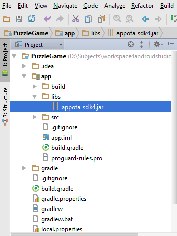

#  Appota Game SDK for Android (Phiên bản 4)	

Phiên bản 4 của Appota Game cho Android đã được triển khai và đang trong chế độ <b>Developer Preview</b>(Bản duyệt trước). Phiên bản 3 sẽ tiếp tục vẫn sẵn có tại repository  [appota-android-game-sdk3](https://github.com/appota/android-game-sdk3).


[1. Import Appota SDK 4](#1-import-appota-sdk-4)

[2. Những APIs phía client](#2-client-apis)
 
[2.1. Khởi tạo Appota SDK4 trong project](#2-1-kh-i-t-o-appota-sdk4-trong-project)

[2.2. Cấu hình SDK](#2-2-configure-sdk)

[2.3. Các chức năng liên quan đến người dùng](#2-3-c-c-ch-c-n-ng-li-n-quan-n-ng-i-d-ng)

[2.3.1. Đăng ký](#2-3-1-register)

[2.3.2. Đăng nhập](#2-3-2-login)

[2.3.3. Hiển thị hộp thoại thông tin người dùng](#2-3-3-show-user-information)

[2.3.4. Truy xuất thông tin người dùng](#2-3-4-get-user-information)

[2.3.5. Đăng xuất](#2-3-4-logout)

[2.3.6. Mời bạn bè từ Facebook](#2-3-6-invite-facebook-friends)

[2.3.7. Phiên đăng nhập](#2-3-7-login-session)

[2.4. Các chức năng liên quan đến thanh toán](#2-4-c-c-ch-c-n-ng-li-n-quan-n-thanh-to-n)

[2.5. Các chức năng liên quan đến push notification](#2-5-c-c-ch-c-n-ng-li-n-quan-n-push-notification)

[2.6. Các chức năng liên quan đến thống kê](#2-6-c-c-ch-c-n-ng-li-n-quan-n-th-ng-k)

[3. Xử lý - Đảm nhiệm crash](#3-exception)


## [1. Import Appota SDK4](#header1)

- Sao chép tệp tin appota_sdk4.jar vào thư mục libs của project.

  	a.Làm việc với Eclipse

	

  	b.Làm việc với Android Studio

	

- Những thư viện đã được tích hợp sẵn vào trong Android SDK4 được liệt kê dưới đây.(Nếu bạn đang dùng những thư viện này thì hãy loại bỏ tệp tin thư viện đó trong thư mục libs ở project):
	
		- khandroid-httpclient-4.2.3.jar (khandroid.ext.apache.http)
		- twitter4j-core-3.0.5.jar ( twitter4j )

	*Chú ý* : Nếu bạn dùng Proguard, hãy thêm cấu hình dưới đây vào tệp tin cấu hình proguard của bạn:

	`-dontwarn com.appota.** ` 

	`-dontwarn twitter4j.**`  

	`-keep class com.appota.**{*;} `

## [2. Những APIs phía client](#header2)
### [2.1. Khởi tạo Appota SDK4 trong project](#header21)

* Gọi `AppotaGameSDK.getInstance().init(activity,appotaSDKCallback)` trong onCreate của activity bắt đầu ứng dụng của bạn.
	
	```java
	public interface AppotaGameSDKCallback {

		public String getPaymentState(String packageID); // if you don't set specific Payment Package, packageID will be an empty string.
	
		public void onUserLoginSuccess(AppotaUserLoginResult userInfo);

		public void onUserLoginError(String errorMessage);
	
		public void onUserLogout(String userName);
	
		public void onPaymentSuccess(AppotaPaymentResult paymentResult,String packageId);
		
		public void onPaymentError(String errorMessage);

		public void onCloseLoginView();
		
	}
	```
	

	[Xem chi tiết AppotaPaymentResult ở 2.4.c](#2-4-c-c-ch-c-n-ng-li-n-quan-n-thanh-to-n)	


	Ví dụ:

	


* Những phương thức mở rộng:

      a. Ẩn màn hình chào: (mặc định là hiển thị)

		AppotaGameSDK.getInstance().hideWelcomeView(true).init(activity,sdkCallback);


	Chú ý.

	Gọi **AppotaGameSDK.getInstance().finishSDK()**  khi ứng dụng đóng lại.

	
### [2.2. Cấu hình SDK](#header22)

*	Cấu hình Manifest:
	
	* Open file AndroidManifest.xml in your Android project.
	
	
	    

	* Cấu hình quyền cơ bản(permissions) để SDK hoạt động đúng chức năng.

		`<uses-permission android:name="android.permission.INTERNET" />`
    
		`<uses-permission  android:name="android.permission.ACCESS_WIFI_STATE" />`

    	`<uses-permission android:name="android.permission.WRITE_EXTERNAL_STORAGE" />`

    	`<uses-permission android:name="android.permission.ACCESS_NETWORK_STATE" />`

    	`<uses-permission android:name="android.permission.GET_ACCOUNTS" />`

    	`<uses-permission android:name="android.permission.USE_CREDENTIALS" />`

    * Quyền để sửa lỗi đăng nhập Google Accounts khi màn hình ứng dụng set ngang và chế độ tự xoay bị tắt.

    	`<uses-permission android:name="android.permission.WRITE_SETTINGS" />`

    * Quyền cho thanh toán Google Play.

    	`<uses-permission android:name="com.android.vending.BILLING" />`

	


	* Khai báo BaseSDKActivity của SDK:

		 `<activity
            android:name="com.appota.gamesdk.v4.ui.BaseSDKActivty"
            android:configChanges="screenSize|orientation|keyboardHidden"
            android:theme="@android:style/Theme.Dialog" >
        </activity>`

	* Khai báo APPOTA API KEY:
	
		`<meta-data
            android:name="com.appota.apiKey"
            android:value="your_appota_api_key" />`

	* Khai báo activity cho Facebook login:
	
		 `<activity
            android:name="com.appota.facebook.LoginActivity"
            android:theme="@android:style/Theme.Translucent.NoTitleBar" />`

		Khai báo thẻ meta-data cho Facebook Application ID

		`<meta-data
            android:name="com.facebook.sdk.ApplicationId"
            android:value="@string/your_facebook_app_id" />`

	* Khai báo thẻ meta-data for Twitter login:
		
		`<meta-data
            android:name="com.appota.twitter.consumer.key"
            android:value="@string/your_twitter_consumer_key" />`

        `<meta-data
            android:name="com.appota.twitter.consumer.secret"
            android:value="@string/your_twitter_consumer_secret" />`

	
		


		Nếu những thẻ này không được set thì cấu hình Twitter sẽ được lấy bởi SDK.


### [2.3. Các chức năng liên quan đến người dùng](#header23)

>- SDK cung cấp những phương thức để tạo, đăng nhập tài khoản(dùng Facebook,Google & Twitter) trên hệ thống Appota vì vậy mà người dùng có thể thực hiện thanh toán bằng tài khoản này.
>
>- **AppotaSDKCallback** là listener khi đăng ký tài khoản thành công, đăng nhập thành công cũng như các sự kiện trên giao dịch thanh toán([Chi tiết AppotaSDKCallback ở 2.1 ](#2-1-kh-i-t-o-appota-sdk4-trong-project)).
>

#### [2.3.1. Đăng ký](#header231)


Màn hình đăng ký có thể được điều hướng từ màn hình đăng nhập.
	

#### [2.3.2. Đăng nhập](#header232)

 Gọi `AppotaGameSDK.getInstance().showLoginView();`   để mở màn hình đăng nhập.


##### [a. Đăng nhập bằng Facebook.](#header232a)

	AppotaGameSDK.getInstance().showLoginFacebook();
	
- Nếu thiết bị của người dùng đã cài đặt ứng dụng Facebook thì sẽ hiển thị một vài hộp thoại thông báo yêu cầu cấp những quyền cơ bản cho SDK.

	

- Nếu thiết bị của người dụng chưa cài đặt ứng dụng Facebook thì một hộp thoại đăng nhập cũng như hỏi quyền cơ bản bằng Web view sẽ hiển thị.


	


##### [b. Đăng nhập bằng Google.](#header232b)


`AppotaGameSDK.getInstance().showLoginGoogle();`

	
Chọn tài khoản Google (địa chỉ Gmail) bạn muốn dùng để đăng nhập.


##### [c. Đăng nhập bằng Twitter.](#header232c)


`AppotaGameSDK.getInstance().showLoginTwitter();`


Đăng nhập Twitter hoặc đăng ký một tài khoản nếu chưa có:


#### [2.3.3. Hiển thị hộp thoại thông tin người dùng](#header233)
	
	AppotaGameSDK.getInstance().showUserInfo();


#### [2.3.4. Truy xuất thông tin người dùng](#header2334)
	
	AppotaGameSDK.getInstance().getUserInfo();


	
sẽ trả về  **AppotaUserLoginResult** ( bao gồm : userId, username, email..)
	

#### [2.3.5. Đăng xuất](#header235)

`AppotaGameSDK.getInstance().logout(true);`

Nếu bạn muốn hiển thị mẫu đăng nhập sau khi gọi phương thức đăng xuất thì truyền  đối số true, ngược lại truyền false.
	

#### [2.3.6. Mời bạn bè Facebook](#header2352)

`AppotaGameSDK.getInstance().inviteFacebookFriends();`


#### [2.3.7. Phiên đăng nhập](#header2352)

Mặc định trạng thái đăng nhập sẽ được giữ đến khi người dùng chọn đăng xuất.

Nếu bạn muốn người dùng phải thực hiện đăng nhập mỗi khi vào ứng dụng và tự động đăng xuất khi người dùng đóng ứng dụng, hãy dùng phương thức dưới đây:

`AppotaGameSDK.getInstance().setKeepLoginSession(false);`

**Chú ý** : Đứng quên gọi `AppotaGameSDK.getInstance().finishSDK();` khi ứng dụng của bạn đóng lại để đảm bảo tính năng này hoạt động bình thường cũng như là những tài nguyên dành cho SDK sẽ được giải phóng.


### [2.4. Các chức năng liên quan đến thanh toán](#header24)

>1.Hướng dẫn thực hiện thanh toán:
>
>-Sau khi đăng nhập bằng SDK, người dùng có thể lựa chọn phương thức để thực hiện thanh toán( qua SMS, Card, Bank, Google Play,Bao Kim..).
>
>-Sau khi người dùng xác nhận để thực hiện thanh toán, hệ thống thanh toán của Appota sẽ hiển thị hộp thoại xác nhận và sẽ kiểm tra gia dịch, nếu thành công, hệ thống sẽ tự động gọi **Notify URL** ( được khai báo trong in dev.appota.com để server của người phát triển xử lý dữ liệu) nếu có.
>
>2.Payment State (state) :
>
>-Payment state là một trường mở rộng. Nó được gán giá trị vởi người phát triển (developer)(giá trị rỗng khi trả về nếu không được gán) trước khi tạo bất cứ thanh toán nào và được trả về sau khi giao dịch thành công. Bạn có thể dùng nó để kiểm tra, xác thực, so sánh..
>Bạn phải bổ xung trong phương thức getPaymentState(AppotaPaymentPackage) để cài đặt giá trị của nó khi khởi tạo SDK.([xem ví dụ ở 2.1 ](#2-1-kh-i-t-o-appota-sdk4-trong-project)).


- a. Hiển thị hộp thoại thanh toán:

	`AppotaGameSDK.getInstance().makePayment();`
	

	`AppotaGameSDK.getInstance().makePayment(String packageID);`

	- packageID : ID của gói thanh toán. Nếu bạn muốn chỉ hiển thị một gói thanh toán, truyền ID của gói khi gọi makePayment hoặc truyền null/empty để hiển thị tất cả các gọi thanh toán. ID gói thanh toán sẽ được nhận lại tại  [getPaymentState(String packageID)](#2-1-kh-i-t-o-appota-sdk4-trong-project)
		

- b. Những phương thức để hiển thị một phương thức thanh toán xác định(chri SMS, Phone Card, Bank,..) không còn dùng trong SDK 4.

- c. Sau khi tạo gói thanh toán thành công, SDK sẽ gọi AppotaGameSDKCallback vì vậy bạn có thể nhận được **AppotaPaymentResult**.

	>AppotaPaymentResult là một đối tượng chứa các thuộc tính của giao dịch.
	> 
	>AppotaPaymentResult bao gồm:
	>
	>- transactionId (string): Id của giao dịch thành công.
	>
	>- type (string): phương thức mà người dùng muốn dùng để tạo thanh toán(SMS,Bank..)
	>- amount (string): Số tiền.
	>
	>- time (Unix time): thời gian mà người dùng thanh toán.
	>
	>- status (int, 0 or 1): thành công ->1, thất bại -> 0.
	>
	>- target(string) : được cài đặt bởi người phát triển giống như state.
	>
	>- state (string): biết đến như là Payment State xem ở trên.
	>
	>- errorMessage (string): thông báo lỗi nếu có.


- d.	Những phương thức khác:
	
	+ `AppotaGameSDK.getInstance().setCharacter(String name,String server,String serverIdentify);`

		để cài đặt thông tin của người dùng trong trò chơi/ứng dụng.

### [2.5. Các chức năng liên quan đến push notification](#header25)
Cài đặt push notification:

	AppotaGameSDK.getInstance().setPushDeviceToken("device_token_for_push_notification").init(activity,sdkCallback);

Cài đặt push notification tới một nhóm:
	
	AppotaGameSDK.getInstance().setPushGroup("device_tokens(group1,group2....)").init(activity,sdkCallback);

### [2.6. Các chức năng liên quan đến thống kê](#header26)

#### [2.6.1 Gửi thống kê hoạt động màn hình](#header261)

	AppotaGameSDK.getInstance().sendView(activityName)

-actvityName: tên của màn hình.


#### [2.6.2 Gửi thống kê sự kiện](#header262)

	AppotaGameSDK.getInstance().sendEvent(category,action,label)

-category: Tên bạn cũng cấp cho nhóm đối tượng mà bạn muốn thống kê sự kiện.

-action : Chuỗi kí tự ứng với mỗi danh mục, và thường dùng định nghĩa kiểu tương tác của người dùng(Click, view, close..)

-label : Một chuỗi kí tự tùy ý để cung cấp thêm vào dữ liệu sự kiện.

	AppotaGameSDK.getInstance().sendEvent(category,action,label,value)

-value : Một giá trị mà bạn muốn dùng để cung cấp dữ liệu kiểu số về sự kiến người dùng(như là số lần sự kiện xảy ra,..)


## 3. Xử lý ngoại lệ##


AppotaGameSDK sẽ ném ra những ngoại lệ nếu cấu hình SDK không đủ hoặc không chính xác.

Đây là những ngoại lệ:

|Tên|Nội dung|
|----|-------|
| `AppotaAPIKeyException`| Không có khai báo com.appota.apiKey khai báo trong AndroidManifest.xml|
|`AppotaFacebookAppIDException`|Không có khai báo com.facebook.sdk.ApplicationId tìm thấy  trong AndroidManifest.xml|
|`AppotaInvalidOperationException`|Ngoại lệ này sẽ được ném ra phụ thuộc vào từng tình huống cụ thể. 

* Cấu hình nâng cao:
	
	Bản thân Appota Game SDK4 có khả năng đảm nhiệm xử lý crash.
	
	Tất cả các ngoại lệ (crash exceptions) sẽ được bắt bởi SDK 4 và sẽ được gửi tới server và sẵn có cho nhà phát triển xem và phân tính.

	Nếu bạn đang sử dụng Crashlytics hay những thư viện báo cáo crashes khác mà bạn vẫn muốn dùng xử lý crashes của SDK, hãy gọi phương thức dưới đây (mặc định tính năng tự động bắt crashes sẽ mở nhưng sẽ bị tắt nếu bạn đang dùng  Crashlytics):

	`AppotaGameSDK.getInstance().autoCatchException();`

	*Bạn phải gọi phương thức autoCatchException()* **trước khi** gọi AppotaGameSDK.init()